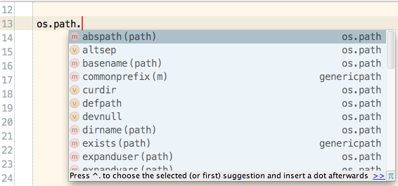
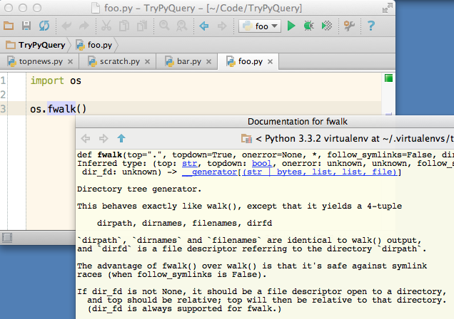

# learning-python
Tasks for colleges to learn python

# Tools
## Editor
Edit your code in editor like PyCharm (Community edition) or IntelliJ Idea (Community edition) because of context documentation and code completion.  

Code completion. Shortcut `ctrl + space`.



Context documentation. Shortcut `ctrl + q`.


 

## Git
Use git to backup and share your project with others. Atlassian company has awesome git explanation: https://www.atlassian.com/git

- What is git about: https://www.atlassian.com/git/tutorials/what-is-version-control
- Basic commands: https://www.atlassian.com/git/tutorials/setting-up-a-repository

# Basic
## Basic 01 - Hello world

Your first task is to create a hello word script in python. So your script has to print "hello word".
 
Hints:
- print function: https://www.w3schools.com/python/ref_func_print.asp
- execute the script: https://askubuntu.com/questions/244378/running-python-file-in-terminal
 
## Basic 02 - Read file
Read file `./files/everything-is-awesome.txt` and output the first row on the screen.

Hints:
- read file: https://www.w3schools.com/python/python_file_open.asp
- types of opening files: https://www.w3schools.com/python/python_file_handling.asp

## Basic 03 - Count lines
Read file `./files/everything-is-awesome.txt` and print count of all lines in the file.

Hint:
- create an integer variable and set it to zero: https://www.w3schools.com/python/python_numbers.asp
- loop through the line of the file and each increase the variable by one: https://www.w3schools.com/python/python_file_open.asp

<!--
## Task 04 - Split string
- https://docs.python.org/2/library/stdtypes.html#str.split
- https://www.pythonforbeginners.com/dictionary/python-split

## Read file and print each word on separate lin

## Task 05 - Case

## Dictionary

## Count 'and' word in whole file

-->
<!--
https://raw.githubusercontent.com/zhiwehu/Python-programming-exercises/master/100%2B%20Python%20challenging%20programming%20exercises.txt
-->

# XML

There are several approaches to XML programming in Python. We will start with XML analysis using python ElementTree and XPath.

Learn about XPath:
- https://www.w3schools.com/xml/xml_xpath.asp
- https://www.w3schools.com/xml/xpath_intro.asp

Core example:
```python
import xml.etree.ElementTree as ET

# Parse XML file and get its root element
root = ET.parse('./files/people.xml').getroot()

# Filter using XPath. 
filtered = root.findall('.//record[firstname="John"]')

for element in filtered:
    print(ET.tostring(element).decode('utf-8'))
```

## XML 01 - Find surnames
Change the example to find all users with surname `Doe`.


## XML 02 - List surnames only
Print surnames to output, one surname per line.
